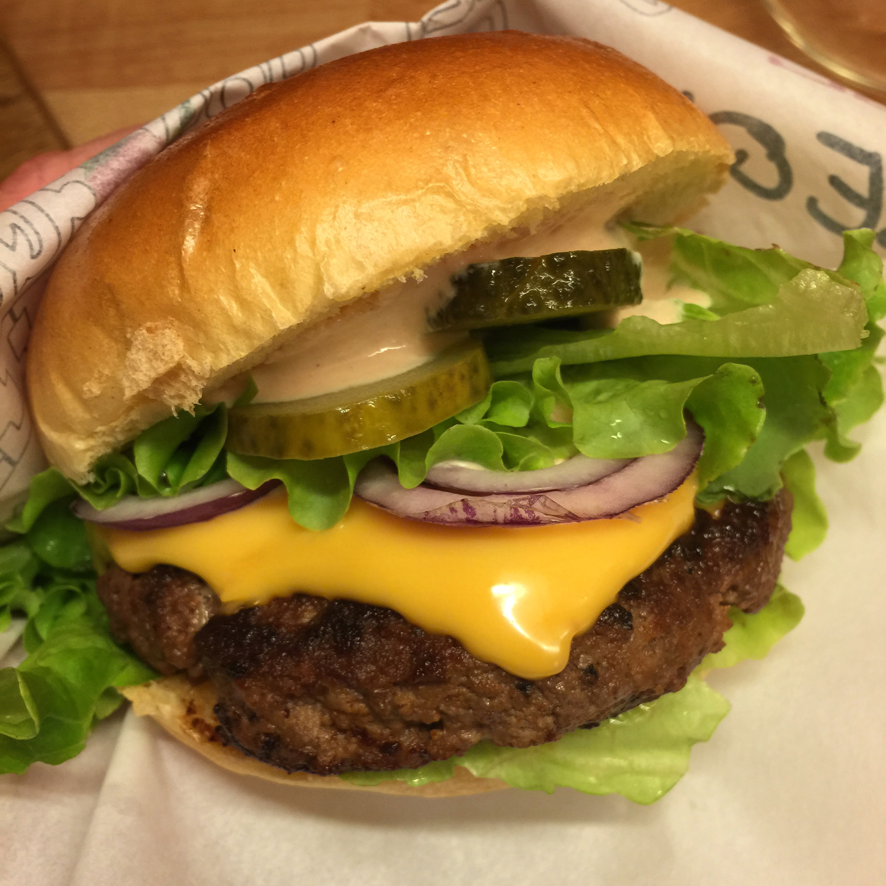
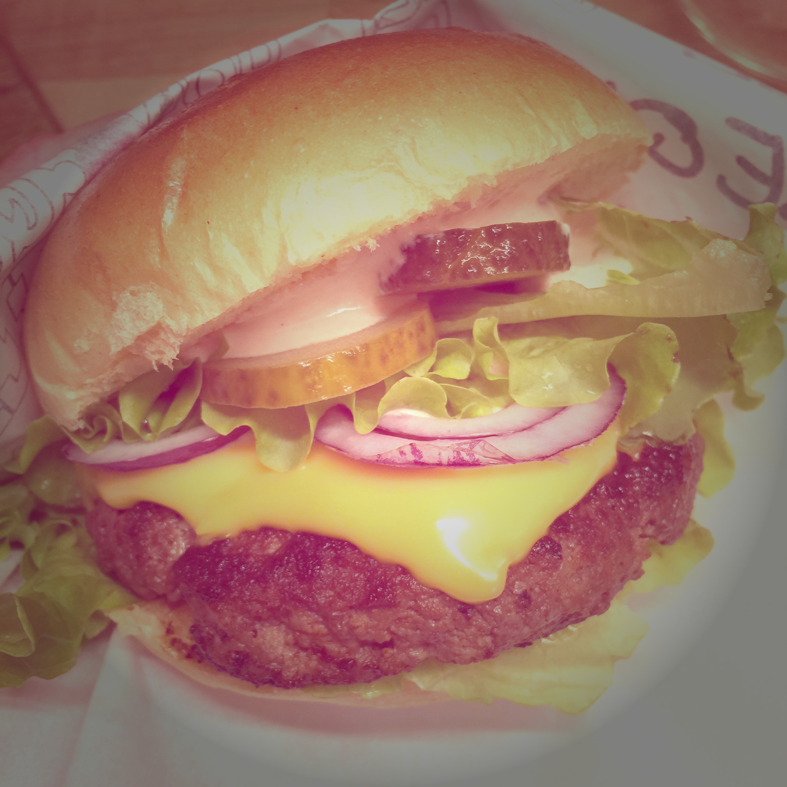

# ImageFilters

A small one header C library for applying simple filters:

# Disclaimer

This software is supplied "AS IS" without any warranties and support

# License

[The MIT license](http://choosealicense.com/licenses/mit/)
